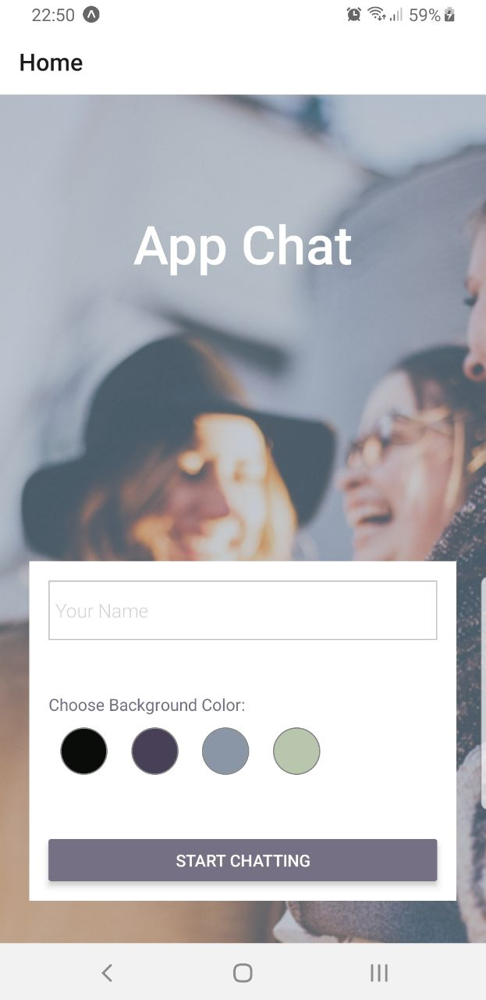
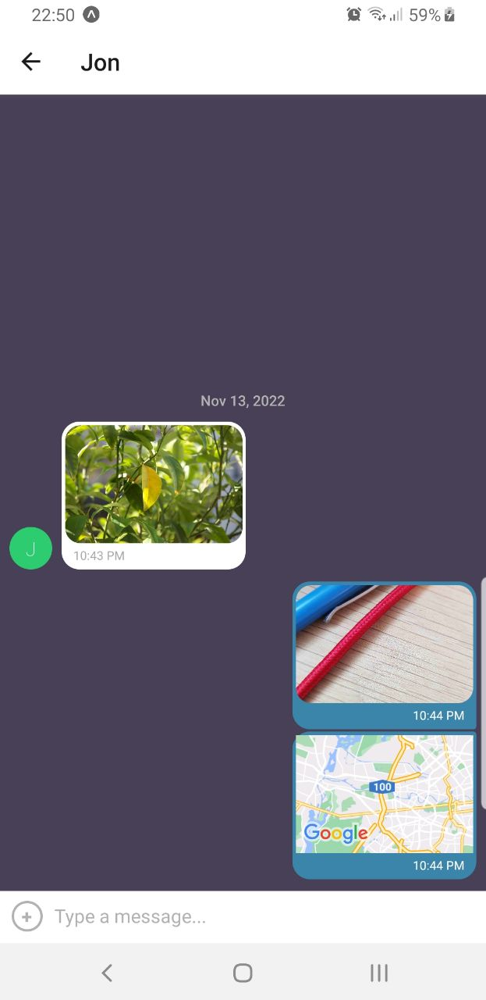

# App-Chat

A chat interface with option to share images, their location and chit-chat with friends online.

---

## How to run the project:

You can use any Emulator or Simulator to run the app on your device. To test this app, I have used Expo Go on iOS. To test the app with Expo, follow the below steps:

1. Clone repository: `git clone https://github.com/knopgm/App-Chat.git`

2. Install Expo CLI as a global npm package: `npm install --global expo-cli`

3. Install all dependecies: `npm install`

4. Start project: `expo start` or `npm start`

5. Launch the app on Expo

---

## Dependencies

- React Native
- Expo
- Google Firestore Database
- Google Firebase Cloud Storage
- Gifted Chat (UI library)
- Android Studio - Emulator

## Key Features:

- Start Page: users can enter their name and choose a background color for the chat screen before joining the chat.
- Chat Page: displays the conversation, as well as an input field and a button to send.
- Storage: messages are stored for users on/offline
- Media: Users can take photos, send from camera roll, and send location

## User Stories:

- As a new user, I want to be able to easily enter a chat room so I can quickly start talking to my friends and family.
- As a user, I want to be able to send messages to my friends and family members to exchange the latest news.
- As a user, I want to send images to my friends to show them what I’m currently doing.
- As a user, I want to share my location with my friends to show them where I am.
- As a user, I want to be able to read my messages offline so I can reread conversations at any time.
- As a user with a visual impairment, I want to use a chat app that is compatible with a screen reader so that I can engage with a chat interface.
